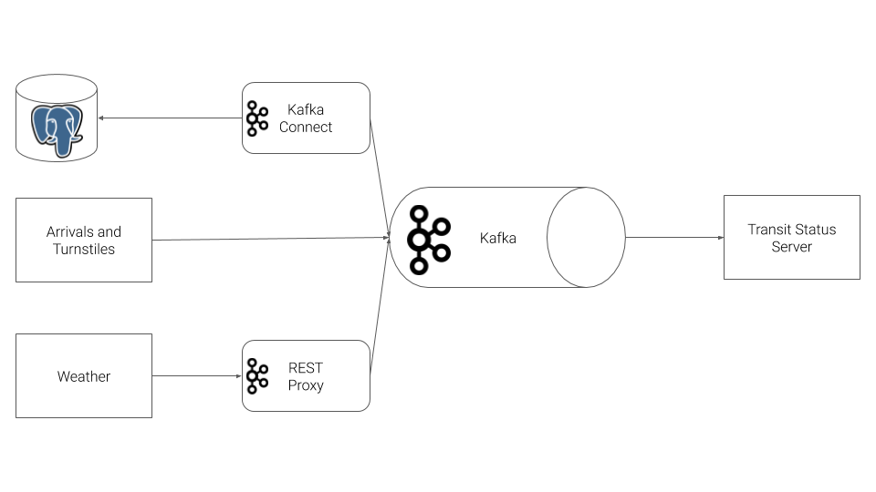

# Data Ingestion with Kafka and Kafka Streaming

## Project Overview
I streamed public transit status from [Chicago Transit Authority](https://www.transitchicago.com/data/) using Kafka and the Kafka ecosystem and built a stream processing application that shows the status of trains in real-time.

I used Confluent Kafka to produce events, REST Proxy to send events over HTTP, and Kafka Connect to collect data from a Postgres database, all of which are sources into Kafka. Then, I used KSQL to combine related data models into a single topic ready for consumption, and built a simple Python application that ingests data from the Kafka topics for analysis. Finally, I leveraged the Faust Python Stream Processing library to further transform train station data into a more streamlined representation. Using stateful processing, I showed whether passenger volume is increasing, decreasing, or staying steady.


## Prerequisites
* Docker
* Python 3.7
* Access to a computer with a minimum of 16gb+ RAM and a 4-core CPU to execute the simulation

## Documentation
* [Confluent Python Client Documentation](https://docs.confluent.io/current/clients/confluent-kafka-python/#)
* [Confluent Python Client Usage and Examples](https://github.com/confluentinc/confluent-kafka-python#usage)
* [REST Proxy API Reference](https://docs.confluent.io/current/kafka-rest/api.html#post--topics-(string-topic_name))
* [Kafka Connect JDBC Source Connector Configuration Options](https://docs.confluent.io/current/connect/kafka-connect-jdbc/source-connector/source_config_options.html)

## Directory Layout
The project consists of two main directories, `producers` and `consumers`.

```

├── consumers
│   ├── consumer.py
│   ├── faust_stream.py
│   ├── ksql.py
│   ├── models
│   │   ├── lines.py
│   │   ├── line.py
│   │   ├── station.py
│   │   └── weather.py
│   ├── requirements.txt
│   ├── server.py
│   ├── topic_check.py
│   └── templates
│       └── status.html
└── producers
    ├── connector.py
    ├── models
    │   ├── line.py
    │   ├── producer.py
    │   ├── schemas
    │   │   ├── arrival_key.json
    │   │   ├── arrival_value.json
    │   │   ├── turnstile_key.json
    │   │   ├── turnstile_value.json
    │   │   ├── weather_key.json
    │   │   └── weather_value.json
    │   ├── station.py
    │   ├── train.py
    │   ├── turnstile.py
    │   ├── turnstile_hardware.py
    │   └── weather.py
    ├── requirements.txt
    └── simulation.py
```

## Project Steps

- Step 1 Create Kafka Producers: The first step is to configure the train stations to emit events. The CTA has placed a sensor on each side of every train station that can be programmed to take an action whenever a train arrives at the station.

- Step 2 Configure Kafka REST Proxy Producer: The second step is to send weather readings into Kafka from CTA's weather hardware. This hardware is old and I cannot use the Python Client Library due to hardware restrictions. Instead, HTTP REST can be used to send the data to Kafka from the hardware using Kafka's REST Proxy.

- Step 3 Configure Kafka Connect: The third step is to extract station information from our PostgreSQL database into Kafka by [Kafka JDBC Source Connector](https://docs.confluent.io/current/connect/kafka-connect-jdbc/source-connector/index.html).

- Step 4 Configure the Faust Stream Processor: The forth step is to leverage Faust Stream Processing to transform the raw Stations table ingested from Kafka Connect. The raw format from the database has more data than needed, and the line color information is not conveniently configured. To remediate this, I ingested data from the Kafka Connect topic, and transformed the data. You can run the Faust processing application with the following command:

    `faust -A faust_stream worker -l info`

- Step 5 Configure the KSQL Table: The fifth step is to aggregate turnstile data for each of the stations.

- Step 6 Create Kafka Consumers: The final step is to consume the data in the web server that is going to serve the transit status pages to the commuters.


## Running and Testing

To run the simulation, you can first start up the Kafka ecosystem on their machine utilizing Docker Compose.

```%> docker-compose up```

Docker compose will take a 3-5 minutes to start, depending on your hardware.

Once docker-compose is ready, the following services will be available:

| Service | Host URL | Docker URL | Username | Password |
| --- | --- | --- | --- | --- |
| Public Transit Status | [http://localhost:8888](http://localhost:8888) | n/a | ||
| Landoop Kafka Connect UI | [http://localhost:8084](http://localhost:8084) | http://connect-ui:8084 |
| Landoop Kafka Topics UI | [http://localhost:8085](http://localhost:8085) | http://topics-ui:8085 |
| Landoop Schema Registry UI | [http://localhost:8086](http://localhost:8086) | http://schema-registry-ui:8086 |
| Kafka | PLAINTEXT://localhost:9092,PLAINTEXT://localhost:9093,PLAINTEXT://localhost:9094 | PLAINTEXT://kafka0:9092,PLAINTEXT://kafka1:9093,PLAINTEXT://kafka2:9094 |
| REST Proxy | [http://localhost:8082](http://localhost:8082/) | http://rest-proxy:8082/ |
| Schema Registry | [http://localhost:8081](http://localhost:8081/ ) | http://schema-registry:8081/ |
| Kafka Connect | [http://localhost:8083](http://localhost:8083) | http://kafka-connect:8083 |
| KSQL | [http://localhost:8088](http://localhost:8088) | http://ksql:8088 |
| PostgreSQL | `jdbc:postgresql://localhost:5432/cta` | `jdbc:postgresql://postgres:5432/cta` | `cta_admin` | `chicago` |

Note that to access these services from your own machine, you will always use the `Host URL` column.

When configuring services that run within Docker Compose, like **Kafka Connect you must use the Docker URL**. When you configure the JDBC Source Kafka Connector, for example, you will want to use the value from the `Docker URL` column.

- To run the `producer`:

    1. `cd producers`
    2. `virtualenv venv`
    3. `. venv/bin/activate`
    4. `pip install -r requirements.txt`
    5. `python simulation.py`

- To run the Faust Stream Processing Application:
    1. `cd consumers`
    2. `virtualenv venv`
    3. `. venv/bin/activate`
    4. `pip install -r requirements.txt`
    5. `faust -A faust_stream worker -l info`

- To run the KSQL Creation Script:
    1. `cd consumers`
    2. `virtualenv venv`
    3. `. venv/bin/activate`
    4. `pip install -r requirements.txt`
    5. `python ksql.py`

- To run the `consumer`:

    1. `cd consumers`
    2. `virtualenv venv`
    3. `. venv/bin/activate`
    4. `pip install -r requirements.txt`
    5. `python server.py`

Once the server is running, you may hit `Ctrl+C` at any time to exit.
